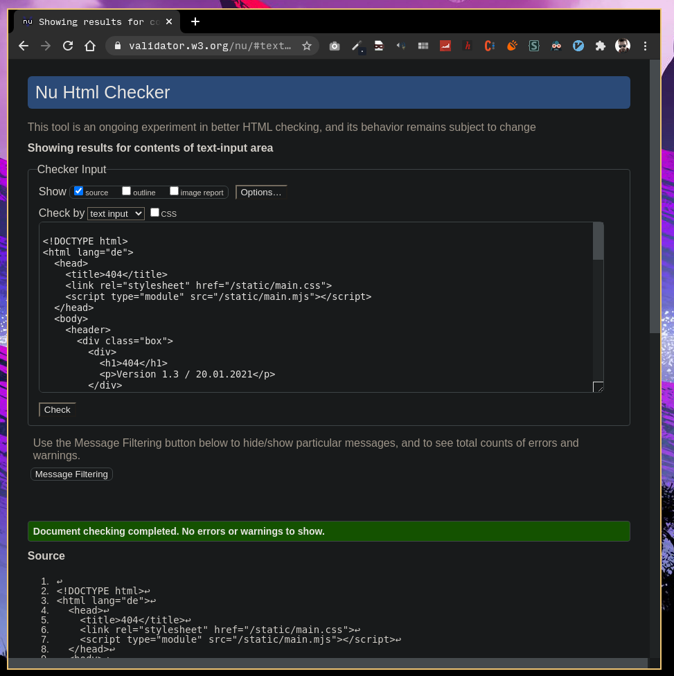

# Mitarbeiter Qualifizierung

## Allgemeine Beschreibung

### Aufgabe der Anwendung

Die Anwendung "Mitarbeiter Qualifizierung" ermöglicht das Erfassen von Mitarbeitern, Weiterbildungen, Zertifikaten und Qualifizierungen.
Mitarbeiter können an Weiterbildungen teilnehmen und erlangen dadurch neue Zertifikate und Qualifikationen.
Des weiteren stehen Funktionen zur Auswertung zur Verfügung welche eine Übersicht über alle Mitarbeiter und deren Zertifikate und Qualifikationen liefern.

### Übersicht der fachlichen Funktionen

#### Startseite

Hier wird die Anzahl der bereits erfassten Mitarbeiter, Weiterbildungen und der gesamten Teilnahmen an diesen angezeigt.

#### Pflege

Die Pflege Seiten stellen Funktionalität zur Verwaltung der Daten zur Verfügung.
Es können neue Mitarbeiter, Weiterbildungen, Zertifikate und Qualifikationen angelegt werden.
Den Weiterbildungen können hier die Zertifikate und Qualifikationen zugeordnet werden welche die Mitarbeiter durch eine erfolgreiche Teilnahme erlangen können.

#### Teilnahme

Auf den Teilnahme Seiten hat der Nutzer die Möglichkeit Teilnahmen an Weiterbildungen zu verwalten.
Die Sichtweise Mitarbeiter listet alle erfassten Mitarbeiter im System auf und ermöglicht über eine Detailansicht die Mitarbeiter für eine Weiterbildung einzutragen.
In der Weiterbildungsansicht werden alle laufenden Weiterbildungen gelistet und über die Detailansicht kann der Status der Teilnahmen für die einzelnen Mitarbeiter angepasst werden.

#### Auswertungen

Die Auswertungsseiten liefern einen Überblick über aktuelle Teilnahmen inklusive Status und den bereits erlangten Zertifikaten der einzelnen Mitarbeiter.

## Beschreibung der Komponenten des Servers

### application.py

#### Zweck

Der Application Controller liefert das HTML der Seite.

#### Zusammenwirken mit anderen Komponenten

Der Application Controller wird nicht von anderen Komponenten aufgerufen und liefert direkt dem Browser das HTML.

#### API

`def default(self, *_args, **_kwargs)`

Liefert den HTML Code der Seite egal welche Route aufgerufen wurde.

### api.py

#### Zweck

Liefert die Viewmodels der Templates.

#### Zusammenwirken mit anderen Komponenten

Wird Clientseitig vom Router aufgerufen.

#### API

`def dashboard(self, *_args, **_kwargs)`

Gibt das Viewmodel der Startseite zurück.

`def editEmployees(self)`
    
Gibt das Viewmodel der Mitarbeiter Pflege zurück.

`def viewEmployee(self)`
        
Gibt das Viewmodel der Mitarbeiter Detailansicht zurück.

`def editCertificates(self)`

Gibt das Viewmodel der Zertifikat Pflege zurück.

`def editQualifications(self)`

Gibt das Viewmodel der Qualifikationen Pflege zurück.

`def editTrainings(self)`

Gibt das Viewmodel der Weiterbildungen Pflege zurück.

`def viewTraining(self)`

Gibt das Viewmodel der Weiterbildungs Detailansicht zurück.

`def editTraining(self)`

Gibt das Viewmodel der Weiterbildungsbearbeitungsseite zurück.

`def addTraining(self)`

Gibt das Viewmodel der Seite zum Hinzufügen einer Weiterbildung zurück.

`def participationEmployees(self)`

Gibt das Viewmodel der Teilnahme Mitarbeiterübersicht zurück.

`def participationEmployee(self)`

Gibt das Viewmodel der Bearbeitungsseite für Mitarbeiterteilnahmen zurück.

`def participationTrainings(self)`

Gibt das Viewmodel der Teilnahme Weiterbildungsübersicht zurück.

`def participationTraining(self)`

Gibt das Viewmodel der Bearbeitungsseite für Weiterbildungsteilnahmen zurück.

`def reportEmployees(self)`

Gibt das Viewmodel der Mitarbeiterauswertung zurück.

`def reportTrainings(self)`

Gibt das Viewmodel der Weiterbbildungsauswertung zurück.

`def reportCertificates(self)`

Gibt das Viewmodel der Zertifikatauswertung zurück.

### training_api.py, qualification_api.py, employee_api.py und participation_api.py

#### Zweck

Die APIs ermöglichen es die Tabellen des jeweiligen Models (z.B. Employee oder Training) zu manipulieren. Dies wir benötigt um bequem über JavaScript Änderungen vornehmen zu können.

#### Aufbau

Die API benötigen nur das Jeweilige Database Objekt des Models welches die API repräsentieren soll.

#### Zusammenwirken mit anderen Komponenten

Die APIs exposen eigene API Schnittstellen, welche von dem Frontend aufgerufen werden. Somit sind sie von anderen Server Komponenten unabhängig.

#### API

`def __init__(self, database)`

Bei dem initialisieren der APIs wird ein Database object benötigt, welches das Model abbildet.

`def update(self)`

Bei dem update wird über den PostBody als JSON ein Objekt mitgeliefert, welches in der Datenbank aktualisiert werden soll.

`def insert(self)`

Bei dem insert wird über den PostBody als JSON ein Objekt mitgeliefert, welches in der Datenbank eingepflegt werden soll.

`def delete(self, index)`

Bei dem delete wird eine Eintrag mit den entsprechenden index aus der Datenbank gelöscht.

### database.py

#### Zweck

Die Klasse bietet eine Schnittstelle zur SQlite Datenbank.
Die Datenmodels können per decorator aufgesetzt werden was ein automatisiertes erstellen der Tabellen erlaubt.

#### Zusammenwirken mit anderen Komponenten

Instanzen der Datenbanken werden an die API controller übergeben.

#### API

`def __init__(self, model)`

Der Kontruktor bekommt den Typ des Models übergeben und ruft `__createTable()` auf.

`def __createTable(self)`

Erzeugt aus den Metadaten des Models eine passende Tabelle in der Datenbank falls diese noch nicht existiert.

`def insert(self, obj)`

Fügt ein neues Objekt der Tabelle hinzu.

`def update(self, obj)`

Aktualisiert die Daten eines bereits existierenden Objektes in der Tabelle.

`def get_all(self)`

Liefert alle Einträge der Tabelle.

`def get_by_index(self, index)`

Gibt den Eintrag entsprechend des übergebenen Indexes zurück.

`def delete(self, index)`

Löscht den Eintrag entsprechend des übergebenen Indexes.

`def count(self)`

Gibt die Anzahl der Einträge zurück.

`def query(self, sql)`

Erlaubt das Ausführen eines beliebigen SQL Queries welches als String übergeben wird.

`def deserialize_result(self, result, additional_fields = None)`

Erzeugt ein Model/Liste von Models anhand des Rückgabewertes eines queries.
Über additional fields können zusätzliche Felder deserialisiert werden, dabei ist zu beachten dass diese Felder im Query erst nach den ursprünglichen Feldern des Models zurückgegeben werden dürfen.
Außerdem muss im Query die Reihenfolge der Felder mit denen im Model übereinstimmen.

## Datenablage

Die Daten der Anwendung werden in einer SQLite Datenbank gespeichert.
Diese Datenbank ist in folgende Tabellen unterteilt.

- employee
- employee_owns_certificate
- employee_owns_qualification
- training
- training_grants_qualification
- certificate
- qualification
- participation

## Konfiguration

Für die Konfiguration haben wir uns an der Vorlage aus dem ersten Praktikum orientiert und dieser erweitert. Wir haben ein static mapping für das `content` Verzeichnis, dass dieses über `/static/...` erreicht werden kann. Wir haben das static mapping nicht wie in der Vorlage der ersten Praktikums auf den root gemappt um somit besser erkennen zu können, welche Inhalte statisch sind und welche nicht. Außerdem haben wir für den statischen Inhalt `gzip` aktiviert, da wir fanden, dass es ein cooles Feature ist. Wir haben die Application Klasse auf den root gemountet, darüber werden auch alle views erreicht. Außerdem haben wir verschiedene APIs für z.B. Mitarbeiter und Qualifikationen an jeweils `/api/MODEL` gemountet also z.B. `/api/employee/`.

## Durchführung und Ergebnis der geforderten Prüfungen

### Markup Validierung

Wir haben nur eine HTML Seite, welche von dem Server ausgeliefert wird. Dieser haben wir hier getestet.

### CSS Validierung

Wir haben den Source Code von allen CSS-Dateien mit dem [CSS Validator](http://jigsaw.w3.org/css-validator/validator) überprüft und sind zu folgenden Ergebnissen gekommen.

| Datei | Fehler |
| --- | --- |
| main.css | 0 |
| layout.css | 0 |
| counter.css | 2 |

Die Fehler in der counter.css Datei kommen daher zustande, dass wir sehr neue CSS Regeln nutzen, welche noch nicht in dem CSS3 Standard sind. Die Counter animation wird z.B. nur von Chrome bzw. Chromium unterstützt. Das ist aber nicht schlimm, da Browser welche die Animation nicht unterstützen immer noch alles anzeigen können. Es ist natürlich schade aber nicht das Ende, wenn nicht alle Browser die tolle Animation darstellen können.
